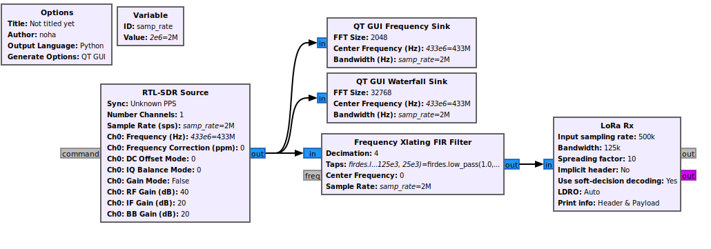

# RTL-SDR v3 and GNU Radio Experiments

I am experimenting with RTL-SDR v3 and GNU Radio. So far, I have:

- Created a flowgraph for an FM receiver and listened to various FM radio stations.  
   
  [View Flowgraph File](./aFM.grc)
- Simulated LoRa communication.  
     
   [View Flowgraph File](./SimulateLora.grc)
- Received real-time LoRa signal data using RTL_SDR sent from a SX127 LoRa module connected to a Raspberry Pi Pico using the following MicroPython code:

    ```python
    from machine import Pin, SPI
    from sx127x import SX127x
    from time import sleep

    # --- SPI + Pin Setup ---
    spi = SPI(0, baudrate=5000000, polarity=0, phase=0, sck=Pin(2), mosi=Pin(3), miso=Pin(4))
    pins = {"ss": 5, "dio_0": 7, "reset": 6}

    # --- Init LoRa ---
    lora = SX127x(spi=spi, pins=pins)
    lora.set_frequency(433000000)  # 433 MHz
    lora.set_tx_power(14)          # dBm
    lora.set_spreading_factor(10)  # SF10
    lora.set_signal_bandwidth(125E3) # 125 kHz
    lora.set_coding_rate(5)        # 4/5
    lora.enable_CRC(True)
    lora.set_sync_word(0x13)

    print("LoRa Transmitter Ready...")
    count = 0
    while True:
            msg = f"Hello SDR #{count}"
            print("🔴 Sending:", msg)
            lora.println(msg)
            count += 1
    ```
        
   The signal was received using my RTL-SDR v3 and processed in GNU Radio with the flowgraph file [LoraListen.grc](./LoraListen.grc).
    

More updates to follow as I continue exploring SDR and signal processing!
