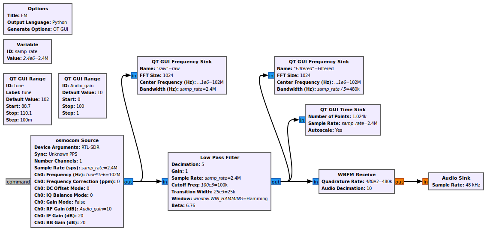
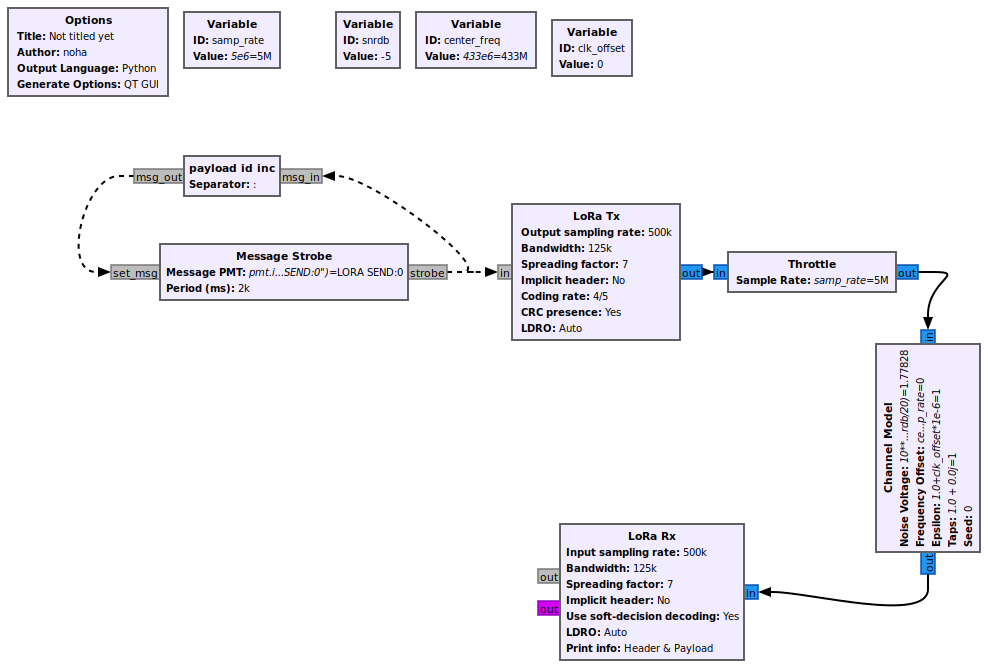

# RTL-SDR v3 and GNU Radio Experiments

I am experimenting with RTL-SDR v3 and GNU Radio. So far, I have:

- Created a flowgraph for an FM receiver and listened to various FM radio stations.  
    
- Simulated LoRa communication.  
    

More updates to follow as I continue exploring SDR and signal processing!